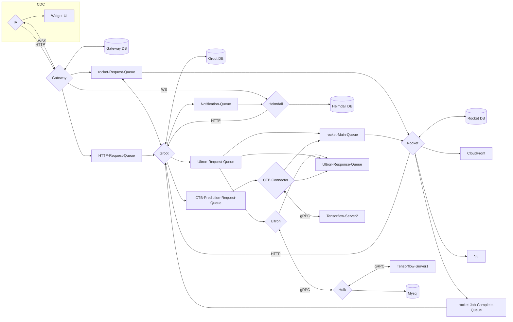

| **Backend Services Architecture and Design Description** | **OPT-SW-025** | **Version 2** |
| --- | --- | --- | --- |

# Title: Backend Services Architecture and Design Description

# Project\Product: Annalise Enterprise

# Document Number: OPT-SW-025

# Version: 2

**DO NOT EDIT THIS PAGE OR THE HEADERS.**

**To update this page press Ctrl+A then F9 to update the document fields. (this red section will not appear when printed)**

**If this is the OPT-XXX-###– copy this document and rename it to match the document you are updating.**

# Table of Contents
<!-- START doctoc generated TOC please keep comment here to allow auto update -->
<!-- DON'T EDIT THIS SECTION, INSTEAD RE-RUN doctoc TO UPDATE -->

- [Revision History](#revision-history)
- 
- [1 Purpose](#1-purpose)
- [2 Scope](#2-scope)
- [3 References](#3-references)
- [4 Architecture and Design](#4-architecture-and-design)
  - [4.1 Overview](#41-overview)
    - [4.1.1 Receive study information from the Integration Adapter](#411-receive-study-information-from-the-integration-adapter)
      - [4.1.1.1 CXR-ede](#4111-cxr-ede)
      - [4.1.1.2 CTB](#4112-ctb)
    - [4.1.2 Send prediction request message to AI model](#412-send-prediction-request-message-to-ai-model)
      - [4.1.2.1 CXR](#4121-cxr)
      - [4.1.2.2 CTB](#4122-ctb)
    - [4.1.3 Receive request from the Annalise Viewer](#413-receive-request-from-the-annalise-viewer)
    - [4.1.4 Save settings, blacklists, and translations](#414-save-settings-blacklists-and-translations)
    - [4.1.5 Dispatch prediction results for Triage](#415-dispatch-prediction-results-for-triage)
    - [4.1.6 Purge expired data](#416-purge-expired-data)
  - [4.2 Design](#42-design)
    - [4.2.1 Cloud Architecture Diagram](#421-cloud-architecture-diagram)

<!-- END doctoc generated TOC please keep comment here to allow auto update -->

# Revision History

| **Version**   | **Date**   | **Description of change**   | **Author \ Updated by**   |
| --- | --- | --- | --- |
| 0 | Jun-2021 | Initial Version | Jenesia Fernandes |
| 1 | Oct-2021 |
- Add Details of the Data Purge Functionality
- Add configuration and tooling section
 | Jenesia Fernandes |
| 2 | Apr-2022 |
- Updated document for release 3.0.0
- Update configurations section to have details about organisation creation
- Updated CXR sequence diagrams to use Integration Adapter instead of Integration Layer
- Added missing parts to the on prem diagram
 | Ida Rahnama |

#

# 1 Purpose

The purpose of this document is to capture and define the key architecture design elements of the Annalise Enterprise backend services. As a reference document, it addresses the key design decisions and captures the detailed design.

# 2 Scope

The architecture design description in this document is constrained to the following scope:

- The backend services components of the Annalise Enterprise product.
- Infrastructure for the backend services components of the Annalise Enterprise product.

# 3 References

**Input Documents**

1. OPT-SYS-040 – Annalise Backend Software Requirements Specification

# 4 Architecture and Design

This section describes the architecture and design of the backend services as well as the constraints on the design.

## 4.1 Overview

Listed below are the high-level functions of the Backend Services.

### 4.1.1 Receive study information from the Integration Adapter

#### 4.1.1.1 CXR-ede

1. Receive CXR images from the Integration Adapter.
2. Process and extract relevant study information and store into a database.
3. Store the images into a secure object storage.

#### 4.1.1.2 CTB

1. Receive CTB registered archives from the Integration Adapter.
2. Process and extract relevant study information and store into a database.
3. Store the registered archives into a secure object storage.
4. Generate coronal and sagittal views from axial pngs and store into a secure object storage.
5. Down sample registered archives and save to a secure object storage.

### 4.1.2 Send prediction request message to AI model

#### 4.1.2.1 CXR

1. Receive a &#39;study is ready for AI processing&#39; message from the Integration Adapter.
2. Prepare and transmit the study images to the AI model for prediction.
3. Store AI model prediction into a database.
4. Store segmentation data into a secure object storage.

#### 4.1.2.2 CTB

1. When the down sample is complete in the backend a prediction request message is sent to the AI model.
2. Store AI model prediction into a database.
3. Store segmentation data into a secure object storage.

### 4.1.3 Receive request from the Annalise Viewer

1. Send study information, images, feedback data, and AI model findings.
2. Send generic feedback as well as feedback on AI model findings.

### 4.1.4 Save settings, blacklists, and translations

1. Save organization, modality, and modality AI settings.
2. Blacklist old/ incompatible versions of the applications.
3. Save translations to display AI models findings in various supported languages.

### 4.1.5 Dispatch prediction results for Triage

1. Send AI prediction results back to the Integration Adapter.

### 4.1.6 Purge expired data

1. Evaluate input data at configured intervals to verify if data has been expired and purge the expired input data from storage.
2. Evaluate output data at configured intervals to verify if data has been expired and purge the expired input data from storage as well as database tables.

## 4.2 Design

An asynchronous microservices architecture has been selected as the appropriate design choice for the Annalise Enterprise backend using queues (AWS SQS for Cloud and RabbitMQ for On Prem) to transmit messages from one service to the next in a unidirectional pattern. The aim of this approach is to ensure that each component has a small and narrowed function which is decoupled as much as possible from all the other narrowed functions that the backend services provide. The advantage of the microservices pattern is that each individual component can be independently scaled as needed and mitigates against single points of failure i.e., if individual components fail, then they can be restarted in isolation of the other components.

### 4.2.1 Cloud Architecture Diagram

_Figure 1: Cloud Architecture Diagram_